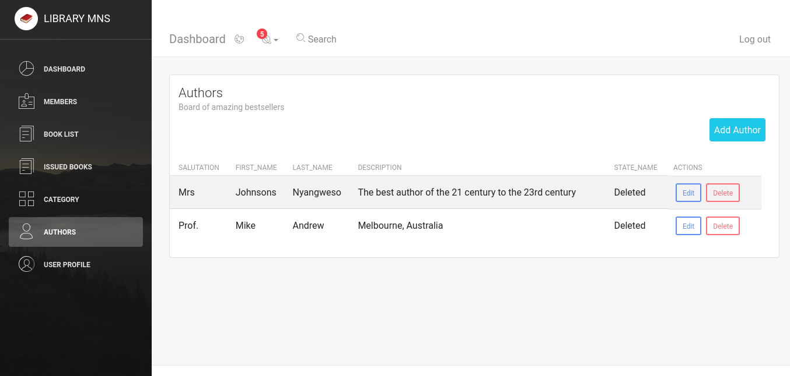
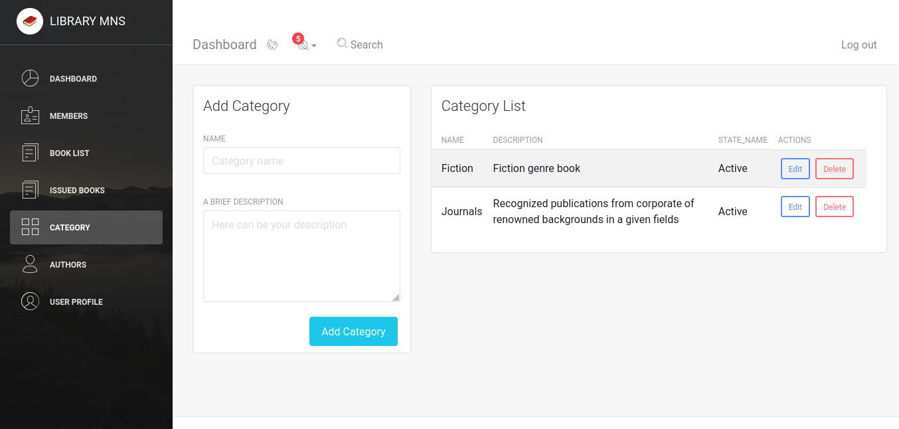
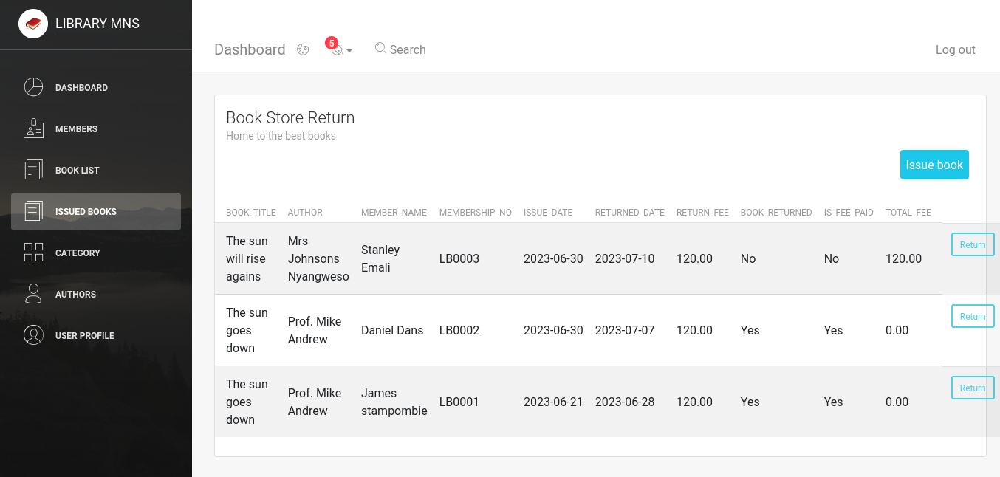
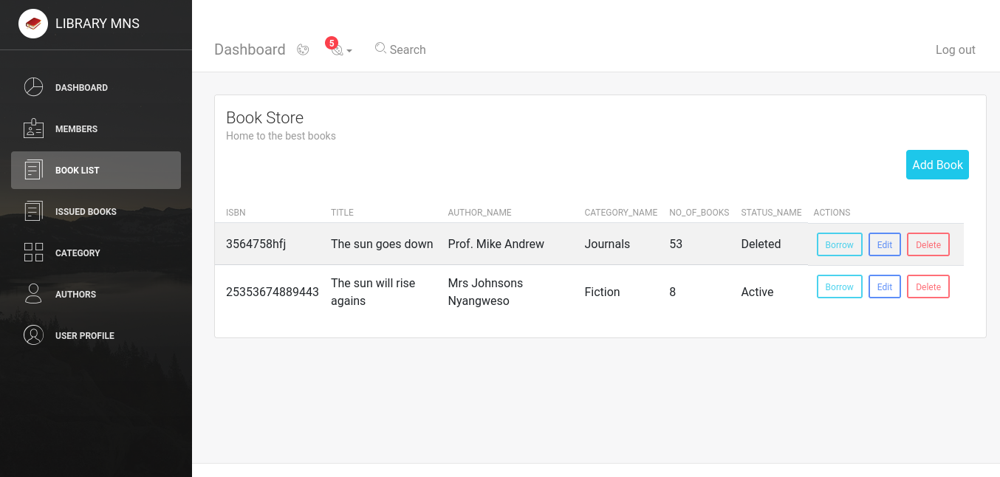
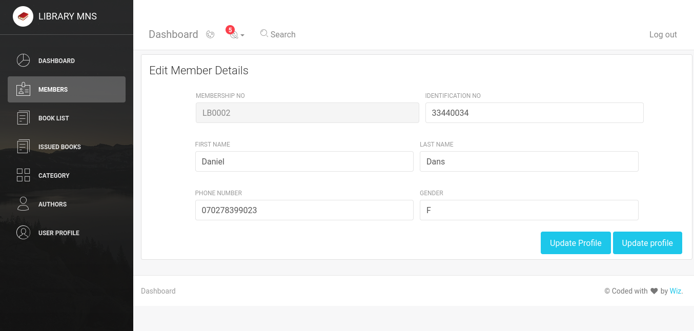
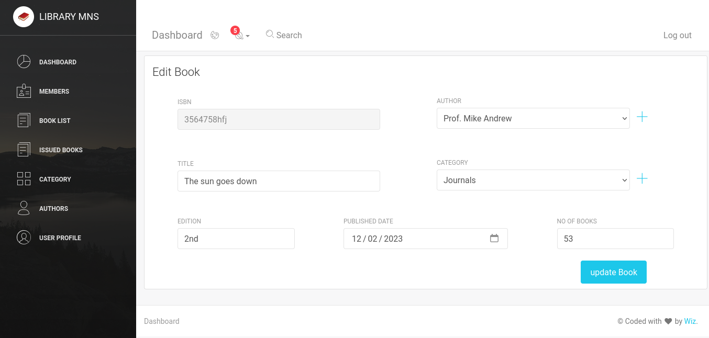
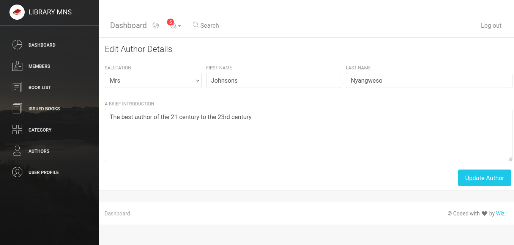
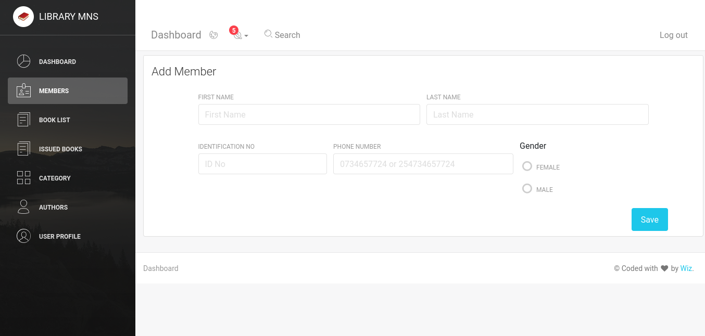

# Library-manager    

Library management system
Library management system UI

Book Author

Book category CRUD

Book Issued

List of all books

list of member

update member

edit book

edit author

add member
